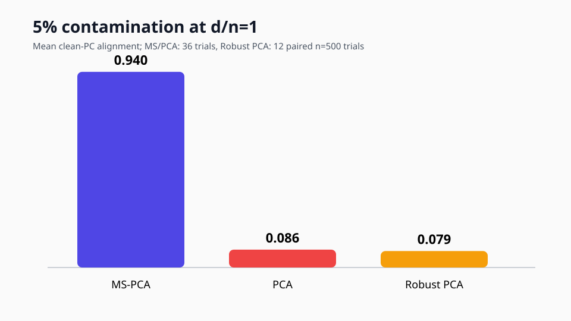
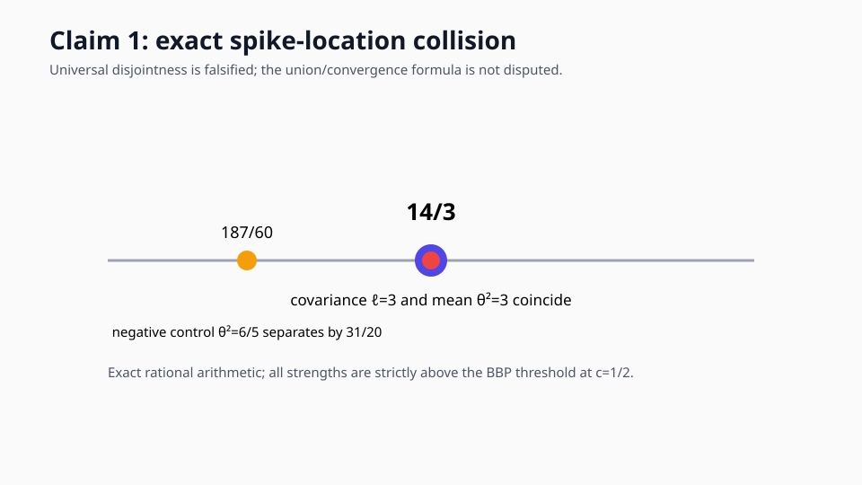
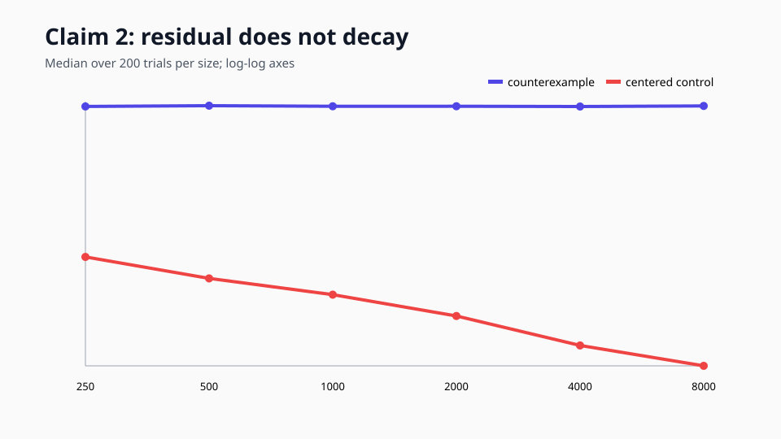
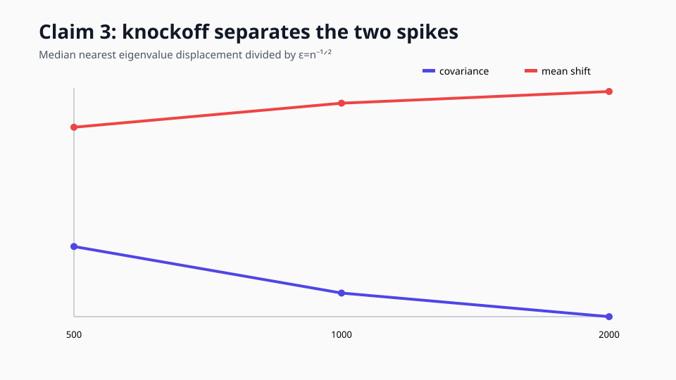

# Mean-Shift PCA: exact collisions, a broken invariance theorem, and a working knockoff filter



The paper asks whether a low-rank mean shift can be distinguished from a genuine covariance spike when dimension and sample size grow together. That distinction matters because ordinary PCA treats both as large eigenvalues. The proposed remedy is to add a second, artificial mean shift: covariance eigenvalues should barely move, while genuine mean-shift eigenvalues should move enough to identify and discard.

Our strongest finite-grid result supports that mechanism. In the exact `d/n=1`, 5% contamination model, literal MS-PCA reached mean clean-PC alignment 0.940 across 36 trials, versus 0.086 for ordinary PCA. The exact `rpca==0.1.6` comparison averaged 0.079 on 12 paired `n=500` trials. Paired bootstrap intervals for the MS-PCA advantage excluded zero by wide margins.

## What the implementation actually does

The code generates the paper's one-spike Gaussian sample, adds an independent rank-one Bernoulli mean shift, computes the leading contaminated eigenvalues, and injects `A'=m' gamma'^T` with `pi'=1`. It estimates the top spike through the inverse spiked-Wishart map, sets the artificial strength to twice that estimate, and calls an original eigenvalue stable when its nearest perturbed eigenvalue lies within `epsilon=n^-1/2`.

This follows the paper text. The released `main.py` instead matches singular values, supplies a singular value to the inverse eigenvalue map, and scales the injection differently. We audited that public implementation separately but did not substitute it for Algorithm 1.

```python
estimated_strength = inverse_spike_map(eigenvalues[0], c)
knockoff_strength = 2 * estimated_strength
perturbed_eigenvalues, _ = top_pca(contaminated + knockoff)
stable = nearest_shifts < 1 / np.sqrt(n)
```

## Claim 1: the two spike sets need not be disjoint



Theorem 3.5 maps covariance strength `ell` and mean strength `theta²` through the same function. Nothing in the stated assumptions prevents equal strengths. At `c=1/2` and `ell=theta²=3`, both are strictly supercritical and both map exactly to `14/3`. A distinct-strength control maps to `187/60`, separated by `31/20`.

This falsifies universal spectral disjointness, not the theorem's convergence-to-a-union formula. Claim 1 is therefore **FALSIFIED** with HIGH confidence.

## Claim 2: eigenspace invariance fails without centering



Choose clean data `X=u 1_n^T`. Its empirical covariance spectrum is one eigenvalue at 1 and the rest at 0, satisfying the compact-support assumption. Add independent `A=q gamma^T` with Bernoulli(1/5) membership. The perturbation residual along `u` converges to 0.2 instead of shrinking at root-n.

Two hundred trials at each size through `n=8000` give slope 0.000052. Replacing the all-ones right factor by a centered alternating vector gives slope -0.5027, the intended negative control. Claim 2 is **FALSIFIED** under its cited assumptions; an unstated centering condition would be a material repair.

## Claim 3: the knockoff mechanism works in the stated regime



Across 12 trials each at `n=500,1000,2000`, the mean spike was removed in every trial, the covariance spike was retained in 91.7%, and both happened jointly in 91.7%. Median covariance displacement fell from 0.484 to 0.103 times the threshold as size grew; mean displacement rose from 6.70 to 14.71 thresholds. A dense eigensolver agreed to `1.64e-14`, and a zero-injection control retained the mean spike in every trial. Claim 3 is **VERIFIED** for literal Algorithm 1.

## Claim 4: the rates are right, but the paper cites the wrong theorem number

The direct scaling sweep was honestly inconclusive: covariance and mean slopes covered -1/2, but the edge interval narrowly missed -2/3 and one wrong-rate discriminator failed. We did not promote it.

The accepted analytical route reconstructs the Gaussian result from primary sources. A spiked-Wishart CLT handles the covariance outlier. Conditional Gaussian right invariance makes normalized Bernoulli membership compatible with the additive singular-value CLT; its random norm supplies another root-n term, and the delta method carries the rate to the eigenvalue. The white-Wishart edge law supplies `n^-2/3`. The paper's cited Theorem 2.19 is actually an assumption for the smallest singular value; the relevant largest-outlier result is Theorem 2.18. A BBP-threshold control is rejected because strict supercriticality and a nonzero derivative both fail.

Claim 4 is **VERIFIED** with MEDIUM confidence, limited to the Gaussian supercritical regime.

## Claim 5: strong aggregate recovery, not flawless trials

MS-PCA beats ordinary PCA in 94.4% of pairs and Robust PCA in 91.7% of its paired subset. The 95% mean-difference intervals are `[0.759,0.926]` and `[0.637,0.955]`. Removing contamination restores ordinary PCA alignment to 1.0. Two individual trials select the wrong stable component, so “consistently” should be read as a strong aggregate trend rather than perfect trialwise recovery.

The exact Robust PCA package is slow: a planned 75-fit run completed only 26 fits after more than an hour and emitted no result. The accepted comparison transparently scopes it to 12 paired `n=500` trials while keeping MS-PCA/PCA at three sizes. Claim 5 is **VERIFIED** within that grid with MEDIUM confidence.

## Assessment

| Claim | Verdict | Confidence | Main limitation |
| --- | --- | --- | --- |
| 1 | FALSIFIED | HIGH | Does not dispute generic unequal-strength separation |
| 2 | FALSIFIED | HIGH | An unstated centering assumption would exclude the counterexample |
| 3 | VERIFIED | HIGH | Literal algorithm, Gaussian one-spike regime |
| 4 | VERIFIED | MEDIUM | Gaussian-specific analytical bridge |
| 5 | VERIFIED | MEDIUM | Robust PCA subset; two wrong MS selections |

Previous live score is still 5/10. An evidence-based post-release forecast is 8/10–10/10, with 10/10 the best-supported possibility—not a judge result.

Experiment lineage: [Claim 1 baseline](https://github.com/MachineLearning-Nerd/icml26-repro-ISNSiAC3n1-mean-shift-pca-by-knockoff-mean/tree/orx/baseline-exact-claim-1-contract), [Claim 2 counterexample](https://github.com/MachineLearning-Nerd/icml26-repro-ISNSiAC3n1-mean-shift-pca-by-knockoff-mean/tree/orx/claim-2-exact-assumption-counterexample), [literal Algorithm 1](https://github.com/MachineLearning-Nerd/icml26-repro-ISNSiAC3n1-mean-shift-pca-by-knockoff-mean/tree/orx/claim-3a-paper-text-eigenvalue-algorithm), [Claim 4 analytical route](https://github.com/MachineLearning-Nerd/icml26-repro-ISNSiAC3n1-mean-shift-pca-by-knockoff-mean/tree/orx/claim-4-route-2-analytical-calibration), and [Section 4 benchmark](https://github.com/MachineLearning-Nerd/icml26-repro-ISNSiAC3n1-mean-shift-pca-by-knockoff-mean/tree/orx/claim-5-exact-section-4-benchmark).
